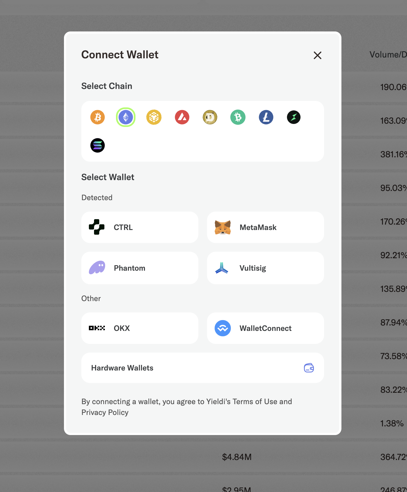

# Yieldi Interview

This is a 1 hour technical pairing interview. You'll have approx 1 hr to complete the challenge.

## Setup

1. Disable AI code generation tool if you have one enabled in your editor.
1. `git clone git@github.com:yieldi-labs/yieldi-web.git`
1. `git checkout xyz`
1. `npm i -g pnpm`
1. `cd shared && pnpm i && cd ..`
1. `cd app && pnpm i`
1. `pnpm dev`

You'll need to add the wallet connect project ID in `.env.development`. I'll give you this.

## Yieldi Wallet Interface

Currently, the wallet interface is partially complete. 

The product requirements are:

1. [DONE] All chains are displayed in a list
1. [DONE] A chain can be selected one at a time.
1. [DONE] If the app detects a wallet via an injected provider API, segregate the detected wallets from the undetected wallets.
1. [TODO] When a user clicks on a chain, only the supported wallets are enabled. The rest are disabled.

This wallet UX is a simplified version of [Thorswap's interface](https://app.thorswap.finance/swap).

## Relevant Files
- [chainConfig](https://github.com/yieldi-labs/yieldi-web/blob/xyz/app/utils/wallet/chainConfig.tsx)
- [WalletModal](https://github.com/yieldi-labs/yieldi-web/blob/xyz/app/app/components/modals/Wallet/WalletModal.tsx)
- [useWalletConnection](https://github.com/yieldi-labs/yieldi-web/blob/xyz/app/app/hooks/useWalletConnection.ts)
- [useWalletList](https://github.com/yieldi-labs/yieldi-web/blob/xyz/app/app/hooks/useWalletList.ts)

## Notes
- The existing implementation and data structures may be suboptimal. You are free to change it.
- `chainConfig` drives the `WalletModal` functionality.
- There is a bug in wallet detection but that's a problem to solve another time.
- There might be more bugs.

